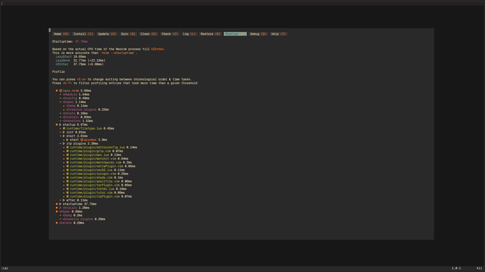
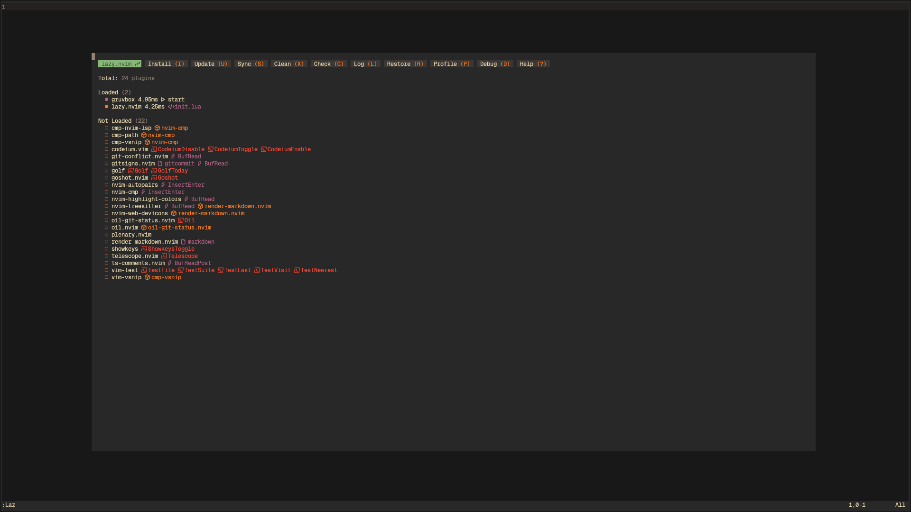
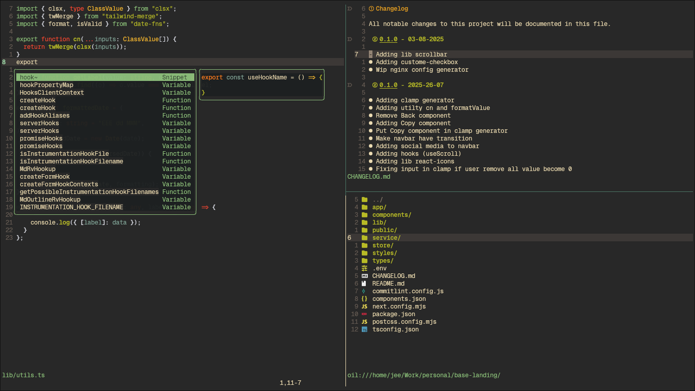
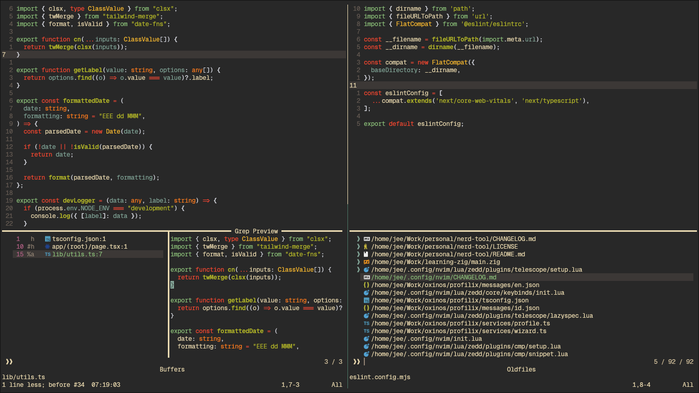

# Znvim

**Znvim** is a blazing-fast and highly customizable Neovim configuration tailored for speed, efficiency, and modern development workflows.

---

## 🚀 Features

- **⚡ Instant Startup**: Lean plugin set and turbocharged config for the fastest launch you've ever seen.
- **🧠 Next-Gen LSP**: Effortless coding with pre-configured support for TypeScript, Lua, Prettier, and more.
- **🎯 Smart Keybinds**: Refined shortcuts for navigation, editing, and refactoring (discover them all with `:Keybinds`).
- **✂️ Dynamic Snippets**: Add, tweak, or create your own snippet files for ultimate code speed.
- **🔭 Custom Telescope UI**: Sleek, intuitive fuzzy search—find files, projects, and more in a flash.
- **🎨 Beautiful & Minimal UI**: Clean interface designed to keep you focused.
- **🛠️ Effortless Customization**: Tweak themes, settings, and plugins to fit your workflow.

---

## 🖼️ Screenshots







---

## 📦 Installation

### 1. Clone Znvim

```sh
git clone https://github.com/Jee-vim/Znvim ~/.config/nvim
```

### 2. Install Required Language Servers

```sh
npm i -g typescript-language-server typescript vscode-langservers-extracted prettier lua-language-server
```

---

## 💡 Contribution

Got an idea, improvement, or bug fix? Pull requests and issues are welcome!

---

## 📚 Resources

- [Neovim Documentation](https://neovim.io/)
- [LSP Setup Guide](https://github.com/neovim/nvim-lspconfig)

---

## 🙋 FAQ

**Q:** How do I list all keybindings?
**A:** Type `:Keybinds` in Neovim.

**Q:** Can I add my own snippets?  
**A:** Absolutely! Check out the snippets directory and customize to your heart’s content.

---

Enjoy lightning-fast editing with Znvim! ⚡
